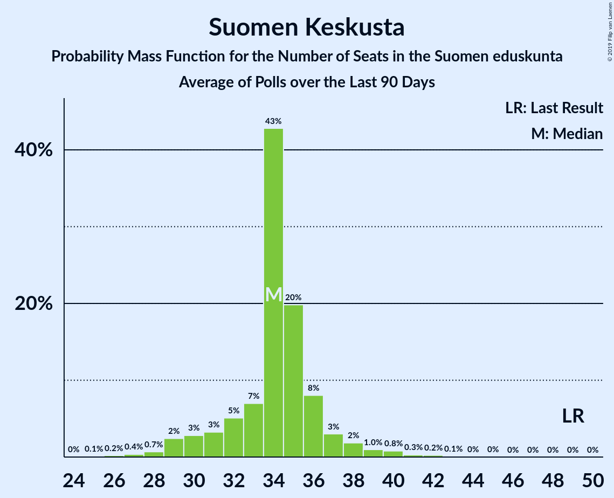

# Suomen Keskusta

<a href="#voting-intentions">Voting Intentions</a> | <a href="#seats">Seats</a>

## Voting Intentions

Last result: **21.1%** (General Election of 19 April 2015)

### Confidence Intervals

| Period     | Polling firm/Commissioner(s) | Median | 80% Confidence Interval | 90% Confidence Interval | 95% Confidence Interval | 99% Confidence Interval |
|:----------:|:----------------:|:-----------:|:-----------------------:|:-----------------------:|:-----------------------:|:-----------------------:|
| N/A | [Poll Average](average.html) | 15.7% | 14.4–17.1% | 14.0–17.5% | 13.6–17.8% | 13.0–18.4% |
| [14–23 November 2018](2018-11-23-Tietoykkönen.html) | Tietoykkönen   Iltalehti and Uusi Suomi | 15.1% | 13.8–16.6% | 13.5–16.9% | 13.2–17.3% | 12.6–18.0% |
| [15 October–12 November 2018](2018-11-12-KantarTNS.html) | Kantar TNS   Helsingin Sanomat | 15.4% | 14.4–16.4% | 14.2–16.7% | 14.0–16.9% | 13.5–17.4% |
| [3 October–6 November 2018](2018-11-06-Taloustutkimus.html) | Taloustutkimus   Yle | 16.5% | 15.5–17.6% | 15.2–17.9% | 14.9–18.2% | 14.5–18.7% |
| [12–30 October 2018](2018-10-30-Tietoykkönen.html) | Tietoykkönen   Iltalehti and Uusi Suomi | 15.2% | 13.9–16.6% | 13.5–17.1% | 13.2–17.4% | 12.6–18.1% |
| [17 September–11 October 2018](2018-10-11-KantarTNS.html) | Kantar TNS   Helsingin Sanomat | 15.7% | 14.8–16.7% | 14.5–17.0% | 14.3–17.2% | 13.9–17.7% |
| [10 September–2 October 2018](2018-10-02-Taloustutkimus.html) | Taloustutkimus   Yle | 17.6% | 16.3–18.9% | 16.0–19.3% | 15.7–19.7% | 15.1–20.3% |
| [14–27 September 2018](2018-09-27-Tietoykkönen.html) | Tietoykkönen   Iltalehti and Uusi Suomi | 15.1% | 13.8–16.6% | 13.4–17.0% | 13.1–17.4% | 12.5–18.2% |
| [20 August–14 September 2018](2018-09-14-KantarTNS.html) | Kantar TNS   Helsingin Sanomat | 15.5% | 14.4–16.7% | 14.1–17.1% | 13.8–17.3% | 13.3–18.0% |
| [13 August–4 September 2018](2018-09-04-Taloustutkimus.html) | Taloustutkimus   Yle | 17.8% | 16.6–19.2% | 16.2–19.5% | 15.9–19.9% | 15.3–20.5% |
| [13–25 August 2018](2018-08-25-Tietoykkönen.html) | Tietoykkönen   Iltalehti and Uusi Suomi | 15.5% | 14.2–16.9% | 13.8–17.3% | 13.5–17.7% | 12.9–18.4% |
| [16 July–16 August 2018](2018-08-16-KantarTNS.html) | Kantar TNS   Helsingin Sanomat | 15.5% | 14.3–16.7% | 14.0–17.1% | 13.7–17.4% | 13.2–18.0% |
| [9 July–7 August 2018](2018-08-07-Taloustutkimus.html) | Taloustutkimus   Yle | 17.8% | 16.8–18.8% | 16.6–19.1% | 16.3–19.4% | 15.9–19.8% |
| [11 June–12 July 2018](2018-07-12-KantarTNS.html) | Kantar TNS   Helsingin Sanomat | 15.3% | 14.4–16.3% | 14.2–16.5% | 13.9–16.8% | 13.5–17.2% |
| [6 June–3 July 2018](2018-07-03-Taloustutkimus.html) | Taloustutkimus   Yle | 16.6% | 15.7–17.6% | 15.4–17.9% | 15.2–18.1% | 14.7–18.6% |
| [6–26 June 2018](2018-06-26-Tietoykkönen.html) | Tietoykkönen   Iltalehti and Uusi Suomi | 15.9% | 14.6–17.4% | 14.2–17.8% | 13.9–18.1% | 13.3–18.9% |
| [14 May–10 June 2018](2018-06-10-KantarTNS.html) | Kantar TNS   Helsingin Sanomat | 15.8% | 14.9–16.8% | 14.6–17.1% | 14.4–17.3% | 14.0–17.8% |
| [2 May–5 June 2018](2018-06-05-Taloustutkimus.html) | Taloustutkimus   Yle | 17.6% | 16.8–18.5% | 16.5–18.7% | 16.3–18.9% | 16.0–19.3% |
| [18–31 May 2018](2018-05-31-Tietoykkönen.html) | Tietoykkönen   Iltalehti and Uusi Suomi | 15.1% | 13.8–16.5% | 13.5–16.9% | 13.2–17.3% | 12.6–18.0% |
| [16 April–11 May 2018](2018-05-11-KantarTNS.html) | Kantar TNS   Helsingin Sanomat | 15.7% | 14.8–16.7% | 14.5–17.0% | 14.3–17.2% | 13.9–17.7% |
| [19 April–2 May 2018](2018-05-02-Tietoykkönen.html) | Tietoykkönen   Iltalehti and Uusi Suomi | 15.9% | 14.6–17.4% | 14.2–17.8% | 13.9–18.2% | 13.3–18.9% |
| [3–26 April 2018](2018-04-26-Taloustutkimus.html) | Taloustutkimus   Yle | 17.0% | 15.9–18.3% | 15.5–18.6% | 15.3–19.0% | 14.7–19.6% |
| [19 March–12 April 2018](2018-04-12-KantarTNS.html) | Kantar TNS   Helsingin Sanomat | 15.7% | 14.8–16.7% | 14.5–17.0% | 14.3–17.2% | 13.9–17.7% |
| [1–27 March 2018](2018-03-27-Taloustutkimus.html) | Taloustutkimus   Yle | 16.3% | 15.2–17.5% | 14.8–17.9% | 14.6–18.2% | 14.0–18.8% |
| [16–26 March 2018](2018-03-26-Tietoykkönen.html) | Tietoykkönen   Iltalehti and Uusi Suomi | 16.1% | 14.8–17.6% | 14.4–18.0% | 14.1–18.4% | 13.5–19.1% |
| [19 February–15 March 2018](2018-03-15-KantarTNS.html) | Kantar TNS   Helsingin Sanomat | 15.9% | 15.0–16.9% | 14.7–17.2% | 14.5–17.4% | 14.1–17.9% |
| [7–28 February 2018](2018-02-28-Taloustutkimus.html) | Taloustutkimus   Yle | 17.0% | 15.8–18.2% | 15.5–18.6% | 15.2–18.9% | 14.7–19.5% |
| [14–26 February 2018](2018-02-26-Tietoykkönen.html) | Tietoykkönen   Iltalehti and Uusi Suomi | 15.5% | 14.2–16.9% | 13.8–17.4% | 13.5–17.7% | 12.9–18.4% |
| [22 January–15 February 2018](2018-02-15-KantarTNS.html) | Kantar TNS   Helsingin Sanomat | 16.3% | 15.4–17.3% | 15.1–17.6% | 14.9–17.8% | 14.4–18.3% |
| [28 December 2017–6 February 2018](2018-02-06-Taloustutkimus.html) | Taloustutkimus   Yle | 17.4% | 16.5–18.4% | 16.2–18.6% | 16.0–18.9% | 15.6–19.3% |
| [19–29 January 2018](2018-01-29-Tietoykkönen.html) | Tietoykkönen   Iltalehti and Uusi Suomi | 15.4% | 14.1–16.8% | 13.8–17.2% | 13.5–17.6% | 12.9–18.2% |
| [12 December 2017–18 January 2018](2018-01-18-KantarTNS.html) | Kantar TNS   Helsingin Sanomat | 15.6% | 14.7–16.6% | 14.4–16.9% | 14.2–17.1% | 13.8–17.6% |

### Probability Mass Function

The following table shows the probability mass function per percentage block of voting intentions for the [poll average](average.html) for Suomen Keskusta.

| Voting Intentions | Probability | Accumulated | Special Marks |
|:-----------------:|:-----------:|:-----------:|:-------------:|
| 10.5–11.5% | 0% | 100% |  |
| 11.5–12.5% | 0.1% | 100% |  |
| 12.5–13.5% | 2% | 99.9% |  |
| 13.5–14.5% | 12% | 98% |  |
| 14.5–15.5% | 31% | 86% |  |
| 15.5–16.5% | 34% | 56% | Median |
| 16.5–17.5% | 17% | 22% |  |
| 17.5–18.5% | 4% | 4% |  |
| 18.5–19.5% | 0.3% | 0.3% |  |
| 19.5–20.5% | 0% | 0% |  |
| 20.5–21.5% | 0% | 0% | Last Result |

## Seats

Last result: **49** seats (General Election of 19 April 2015)

### Confidence Intervals

| Period     | Polling firm/Commissioner(s) | Median | 80% Confidence Interval | 90% Confidence Interval | 95% Confidence Interval | 99% Confidence Interval |
|:----------:|:----------------:|:------:|:-----------------------:|:-----------------------:|:-----------------------:|:-----------------------:|
| N/A | [Poll Average](average.html) | 35 | 33–40 | 32–41 | 31–42 | 29–44 |
| [14–23 November 2018](2018-11-23-Tietoykkönen.html) | Tietoykkönen   Iltalehti and Uusi Suomi | 35 | 31–38 | 31–40 | 30–41 | 28–43 |
| [15 October–12 November 2018](2018-11-12-KantarTNS.html) | Kantar TNS   Helsingin Sanomat | 35 | 34–39 | 33–40 | 33–41 | 31–42 |
| [3 October–6 November 2018](2018-11-06-Taloustutkimus.html) | Taloustutkimus   Yle | 36 | 35–41 | 34–42 | 34–42 | 33–44 |
| [12–30 October 2018](2018-10-30-Tietoykkönen.html) | Tietoykkönen   Iltalehti and Uusi Suomi | 35 | 32–40 | 31–41 | 30–41 | 29–43 |
| [17 September–11 October 2018](2018-10-11-KantarTNS.html) | Kantar TNS   Helsingin Sanomat | 35 | 34–38 | 33–41 | 33–41 | 32–42 |
| [10 September–2 October 2018](2018-10-02-Taloustutkimus.html) | Taloustutkimus   Yle | 41 | 36–44 | 35–45 | 34–46 | 34–47 |
| [14–27 September 2018](2018-09-27-Tietoykkönen.html) | Tietoykkönen   Iltalehti and Uusi Suomi | 35 | 31–40 | 31–41 | 30–42 | 29–44 |
| [20 August–14 September 2018](2018-09-14-KantarTNS.html) | Kantar TNS   Helsingin Sanomat | 35 | 34–39 | 33–41 | 32–42 | 31–43 |
| [13 August–4 September 2018](2018-09-04-Taloustutkimus.html) | Taloustutkimus   Yle | 42 | 39–45 | 37–45 | 36–46 | 35–48 |
| [13–25 August 2018](2018-08-25-Tietoykkönen.html) | Tietoykkönen   Iltalehti and Uusi Suomi | 35 | 33–40 | 33–42 | 32–43 | 30–44 |
| [16 July–16 August 2018](2018-08-16-KantarTNS.html) | Kantar TNS   Helsingin Sanomat | 35 | 34–38 | 33–40 | 32–41 | 30–42 |
| [9 July–7 August 2018](2018-08-07-Taloustutkimus.html) | Taloustutkimus   Yle | 42 | 38–44 | 37–45 | 35–45 | 35–46 |
| [11 June–12 July 2018](2018-07-12-KantarTNS.html) | Kantar TNS   Helsingin Sanomat | 34 | 34–36 | 33–37 | 32–39 | 31–41 |
| [6 June–3 July 2018](2018-07-03-Taloustutkimus.html) | Taloustutkimus   Yle | 37 | 35–40 | 35–42 | 34–42 | 34–44 |
| [6–26 June 2018](2018-06-26-Tietoykkönen.html) | Tietoykkönen   Iltalehti and Uusi Suomi | 37 | 34–42 | 33–43 | 33–44 | 30–45 |
| [14 May–10 June 2018](2018-06-10-KantarTNS.html) | Kantar TNS   Helsingin Sanomat | 36 | 34–40 | 34–41 | 34–42 | 33–43 |
| [2 May–5 June 2018](2018-06-05-Taloustutkimus.html) | Taloustutkimus   Yle | 41 | 39–44 | 38–45 | 37–45 | 35–46 |
| [18–31 May 2018](2018-05-31-Tietoykkönen.html) | Tietoykkönen   Iltalehti and Uusi Suomi | 35 | 32–39 | 31–41 | 30–42 | 29–43 |
| [16 April–11 May 2018](2018-05-11-KantarTNS.html) | Kantar TNS   Helsingin Sanomat | 35 | 34–39 | 34–41 | 34–41 | 33–42 |
| [19 April–2 May 2018](2018-05-02-Tietoykkönen.html) | Tietoykkönen   Iltalehti and Uusi Suomi | 36 | 34–42 | 34–42 | 33–43 | 30–45 |
| [3–26 April 2018](2018-04-26-Taloustutkimus.html) | Taloustutkimus   Yle | 38 | 35–43 | 35–44 | 35–45 | 34–46 |
| [19 March–12 April 2018](2018-04-12-KantarTNS.html) | Kantar TNS   Helsingin Sanomat | 35 | 34–38 | 34–39 | 34–40 | 32–42 |
| [1–27 March 2018](2018-03-27-Taloustutkimus.html) | Taloustutkimus   Yle | 36 | 34–40 | 33–41 | 33–42 | 33–44 |
| [16–26 March 2018](2018-03-26-Tietoykkönen.html) | Tietoykkönen   Iltalehti and Uusi Suomi | 37 | 34–42 | 34–42 | 34–43 | 32–44 |
| [19 February–15 March 2018](2018-03-15-KantarTNS.html) | Kantar TNS   Helsingin Sanomat | 35 | 34–39 | 34–39 | 34–40 | 33–43 |
| [7–28 February 2018](2018-02-28-Taloustutkimus.html) | Taloustutkimus   Yle | 40 | 35–44 | 35–44 | 34–45 | 34–47 |
| [14–26 February 2018](2018-02-26-Tietoykkönen.html) | Tietoykkönen   Iltalehti and Uusi Suomi | 35 | 34–38 | 33–40 | 32–41 | 30–44 |
| [22 January–15 February 2018](2018-02-15-KantarTNS.html) | Kantar TNS   Helsingin Sanomat | 36 | 34–40 | 34–41 | 34–42 | 33–44 |
| [28 December 2017–6 February 2018](2018-02-06-Taloustutkimus.html) | Taloustutkimus   Yle | 40 | 35–43 | 35–44 | 35–45 | 35–46 |
| [19–29 January 2018](2018-01-29-Tietoykkönen.html) | Tietoykkönen   Iltalehti and Uusi Suomi | 35 | 33–40 | 33–41 | 31–42 | 30–43 |
| [12 December 2017–18 January 2018](2018-01-18-KantarTNS.html) | Kantar TNS   Helsingin Sanomat | 36 | 34–37 | 34–38 | 33–39 | 32–42 |

### Probability Mass Function

The following table shows the probability mass function per seat for the [poll average](average.html) for Suomen Keskusta.

| Number of Seats | Probability | Accumulated | Special Marks |
|:---------------:|:-----------:|:-----------:|:-------------:|
| 27 | 0.1% | 100% |  |
| 28 | 0.1% | 99.9% |  |
| 29 | 0.5% | 99.8% |  |
| 30 | 0.5% | 99.3% |  |
| 31 | 3% | 98.8% |  |
| 32 | 2% | 96% |  |
| 33 | 5% | 94% |  |
| 34 | 23% | 89% |  |
| 35 | 31% | 66% | Median |
| 36 | 10% | 35% |  |
| 37 | 5% | 26% |  |
| 38 | 5% | 21% |  |
| 39 | 4% | 16% |  |
| 40 | 4% | 12% |  |
| 41 | 5% | 7% |  |
| 42 | 2% | 3% |  |
| 43 | 0.5% | 1.0% |  |
| 44 | 0.4% | 0.5% |  |
| 45 | 0.1% | 0.1% |  |
| 46 | 0% | 0% |  |
| 47 | 0% | 0% |  |
| 48 | 0% | 0% |  |
| 49 | 0% | 0% | Last Result |

